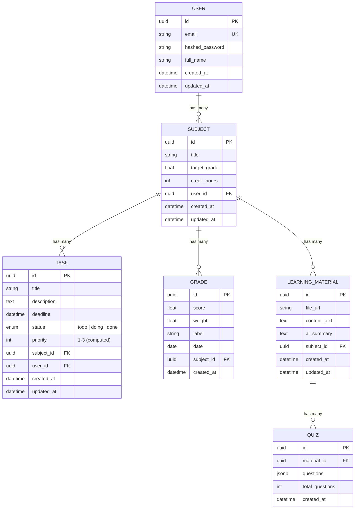

# Smart Study Planner — Implementation Plan

A personal LMS that helps students manage subjects, grades, and use AI to process learning materials. Built with FastAPI + React/TypeScript + PostgreSQL + AI (OpenAI/Groq).

---

## User Review Required

> [!NOTE]
> **✅ All decisions resolved. Proceeding to implementation.**
> - **LLM**: OpenRouter free API (OpenAI-compatible, no cost)
> - **Auth**: Standalone JWT + bcrypt (simple, free, no third-party dependency)
> - **Storage**: Local file storage with abstraction layer (drop-in Supabase later)
> - **Docker**: Full single-command `docker-compose up` (Postgres + Backend + Frontend)

---

## Project Structure

```
smart-study-planner/
├── backend/
│   ├── app/
│   │   ├── __init__.py
│   │   ├── main.py                  # FastAPI app entry point
│   │   ├── core/
│   │   │   ├── __init__.py
│   │   │   ├── config.py            # Pydantic BaseSettings (env vars)
│   │   │   ├── security.py          # JWT creation/verification, password hashing
│   │   │   └── database.py          # AsyncEngine, AsyncSession factory
│   │   ├── models/
│   │   │   ├── __init__.py
│   │   │   ├── base.py              # SQLAlchemy DeclarativeBase
│   │   │   ├── user.py              # User model
│   │   │   ├── subject.py           # Subject model
│   │   │   ├── task.py              # Task model
│   │   │   ├── grade.py             # Grade model
│   │   │   ├── learning_material.py # LearningMaterial model
│   │   │   └── quiz.py              # Quiz model
│   │   ├── schemas/
│   │   │   ├── __init__.py
│   │   │   ├── auth.py              # Register/Login/Token schemas
│   │   │   ├── user.py              # User response schemas
│   │   │   ├── subject.py           # Subject CRUD schemas
│   │   │   ├── task.py              # Task CRUD schemas
│   │   │   ├── grade.py             # Grade CRUD + forecast schemas
│   │   │   ├── learning_material.py # Material schemas
│   │   │   ├── quiz.py              # Quiz schemas
│   │   │   └── ai.py                # AI request/response schemas
│   │   ├── api/
│   │   │   ├── __init__.py
│   │   │   ├── deps.py              # Dependency injection (get_db, get_current_user)
│   │   │   └── v1/
│   │   │       ├── __init__.py
│   │   │       ├── router.py        # Aggregate router
│   │   │       ├── auth.py          # POST /register, /login
│   │   │       ├── subjects.py      # CRUD /subjects
│   │   │       ├── tasks.py         # CRUD /tasks
│   │   │       ├── grades.py        # CRUD /grades + /forecast
│   │   │       └── ai.py            # /ai/summarize, /ai/generate-quiz, /ai/roadmap
│   │   ├── services/
│   │   │   ├── __init__.py
│   │   │   ├── auth_service.py      # Registration, login logic
│   │   │   ├── subject_service.py   # Subject CRUD logic
│   │   │   ├── task_service.py      # Task CRUD + priority calculation
│   │   │   ├── grade_service.py     # Grade CRUD + weighted avg + forecasting
│   │   │   ├── ai_service.py        # LLM integration (summarize, quiz, roadmap)
│   │   │   └── file_service.py      # File upload/storage abstraction
│   │   └── utils/
│   │       ├── __init__.py
│   │       └── text_extraction.py   # PyMuPDF text extraction
│   ├── alembic/                     # Database migrations
│   ├── alembic.ini
│   ├── requirements.txt
│   ├── .env.example
│   └── Dockerfile
├── frontend/
│   ├── src/
│   │   ├── components/              # Shared UI components
│   │   │   ├── ui/                  # Button, Input, Card, Modal, etc.
│   │   │   └── layout/             # Sidebar, Header, PageLayout
│   │   ├── features/
│   │   │   ├── auth/               # Login/Register pages + hooks
│   │   │   ├── dashboard/          # Dashboard overview
│   │   │   ├── subjects/           # Subject management
│   │   │   ├── tasks/              # Task planner + calendar view
│   │   │   ├── grades/             # Grade tracker + forecasting UI
│   │   │   ├── materials/          # Learning materials + AI summary
│   │   │   └── quizzes/            # Quiz taking UI
│   │   ├── hooks/                  # Global custom hooks
│   │   ├── services/               # API client (axios/fetch wrappers)
│   │   ├── store/                  # Zustand global state
│   │   ├── types/                  # Shared TypeScript interfaces
│   │   ├── styles/                 # Tailwind config, global CSS
│   │   ├── App.tsx
│   │   └── main.tsx
│   ├── tailwind.config.ts
│   ├── vite.config.ts
│   ├── tsconfig.json
│   └── package.json
├── docker-compose.yml               # PostgreSQL + backend + frontend
└── README.md
```

---

## Database Schema

### Entity Relationship Diagram



---

## Proposed Changes

### Phase 1: Backend Foundation (Current Focus — Start Here)

This is the **immediate deliverable** as requested: Models → Schemas → AIService.

---

#### [NEW] [requirements.txt](file:///Users/liinad/.gemini/antigravity/scratch/backend/requirements.txt)

Core dependencies:
```
fastapi[standard]>=0.115.0
uvicorn[standard]>=0.30.0
sqlalchemy[asyncio]>=2.0.30
asyncpg>=0.30.0
alembic>=1.13.0
pydantic>=2.7.0
pydantic-settings>=2.3.0
python-jose[cryptography]>=3.3.0
passlib[bcrypt]>=1.7.4
python-multipart>=0.0.9
pymupdf>=1.24.0
openai>=1.30.0
httpx>=0.27.0
```

---

#### [NEW] [config.py](file:///Users/liinad/.gemini/antigravity/scratch/backend/app/core/config.py)

Pydantic `BaseSettings` loading from `.env`:
- `DATABASE_URL` (async PostgreSQL URI)
- `SECRET_KEY`, `ACCESS_TOKEN_EXPIRE_MINUTES`
- `OPENAI_API_KEY` / `GROQ_API_KEY`
- `SUPABASE_URL`, `SUPABASE_KEY` (optional, for storage)

---

#### [NEW] [database.py](file:///Users/liinad/.gemini/antigravity/scratch/backend/app/core/database.py)

- `create_async_engine` with `asyncpg` driver
- `async_sessionmaker` → `AsyncSession`
- `get_db()` async generator dependency

---

#### [NEW] Backend Models (`backend/app/models/`)

6 SQLAlchemy models exactly matching the ER diagram above:
- **`User`** — UUID PK, unique email, hashed password, timestamps
- **`Subject`** — title, target_grade, credit_hours, FK → User
- **`Task`** — title, description, deadline, `TaskStatus` enum (todo/doing/done), priority 1-3, FK → Subject + User
- **`Grade`** — score (0-100), weight (percentage), label, date, FK → Subject
- **`LearningMaterial`** — file_url, content_text, ai_summary, FK → Subject
- **`Quiz`** — questions (JSONB), total_questions, FK → LearningMaterial

All models use:
- UUID primary keys via `uuid4`
- `server_default=func.now()` for timestamps
- Proper `relationship()` with `back_populates`
- Column indexes on foreign keys

---

#### [NEW] Backend Schemas (`backend/app/schemas/`)

Pydantic v2 schemas for each entity:
- `*Create` — input validation for POST
- `*Update` — optional fields for PATCH
- `*Response` — output serialization with `model_config = ConfigDict(from_attributes=True)`
- Special schemas:
  - `GradeForecast` — `required_score: float`, `current_average: float`, `target_grade: float`
  - `AISummarizeRequest/Response` — file upload + summary output
  - `AIQuizRequest/Response` — summary → quiz questions array
  - `AIRoadmapRequest/Response` — goal text → list of generated tasks

---

#### [NEW] [ai_service.py](file:///Users/liinad/.gemini/antigravity/scratch/backend/app/services/ai_service.py)

`AIService` class with pluggable LLM backend:

```python
class AIService:
    """Handles all LLM-powered features."""

    async def summarize_text(self, text: str) -> str:
        """Send extracted text to LLM, return structured summary."""

    async def generate_quiz(self, summary: str, num_questions: int = 5) -> list[QuizQuestion]:
        """Generate MCQ quiz from summary text."""

    async def generate_roadmap(self, goal: str, weeks: int = 4) -> list[RoadmapStep]:
        """Generate a week-by-week learning roadmap for a goal."""
```

- Uses `openai.AsyncOpenAI` client
- Structured prompts with system messages for each feature
- JSON mode for quiz generation (guaranteed parseable output)
- Temperature tuning per use case (low for quiz, medium for roadmap)
- Error handling with retries

---

#### [NEW] [text_extraction.py](file:///Users/liinad/.gemini/antigravity/scratch/backend/app/utils/text_extraction.py)

- `extract_text_from_pdf(file_bytes: bytes) -> str` using PyMuPDF
- Handles multi-page documents
- Basic text cleaning (remove excessive whitespace)

---

#### [NEW] [security.py](file:///Users/liinad/.gemini/antigravity/scratch/backend/app/core/security.py)

- `hash_password(password: str) -> str` using bcrypt
- `verify_password(plain: str, hashed: str) -> bool`
- `create_access_token(data: dict) -> str` JWT encoding
- `decode_access_token(token: str) -> dict` JWT decoding

---

### Phase 2: API Endpoints & Services

#### [NEW] API Routes (`backend/app/api/v1/`)

| Route File | Endpoints | Description |
|---|---|---|
| `auth.py` | `POST /register`, `POST /login` | JWT-based auth |
| `subjects.py` | `GET/POST/PUT/DELETE /subjects` | Full CRUD |
| `tasks.py` | `GET/POST/PUT/DELETE /tasks` | CRUD + filter by status/priority |
| `grades.py` | `GET/POST/PUT/DELETE /grades`, `GET /grades/forecast/{subject_id}` | CRUD + grade forecasting |
| `ai.py` | `POST /ai/summarize`, `POST /ai/generate-quiz`, `POST /ai/roadmap` | AI endpoints |

#### [NEW] Service Layer (`backend/app/services/`)

| Service | Key Logic |
|---|---|
| `auth_service.py` | Register (check duplicate email, hash pw), Login (verify, issue JWT) |
| `task_service.py` | Priority auto-calculation: `priority = f(days_until_deadline, credit_hours)` |
| `grade_service.py` | Weighted average: `Σ(score_i × weight_i) / Σ(weight_i)`. Forecast: solve for required score |
| `file_service.py` | Abstract storage interface (local FS initially, Supabase later) |

---

### Phase 3: Frontend Application

#### [NEW] Frontend scaffold with Vite + React + TypeScript + Tailwind CSS v4

Key pages and components:
- **Dashboard** — overview cards (upcoming tasks, grade summaries, recent materials)
- **Subjects** — CRUD management with cards
- **Task Planner** — Kanban board (todo/doing/done) + Calendar view
- **Grade Tracker** — Per-subject grade table + weighted average display + forecast calculator
- **Materials** — File upload + AI summary display
- **Quiz** — Interactive quiz-taking UI with results
- **Roadmap Generator** — Goal input → generated roadmap display

State management: **Zustand** (lightweight, TypeScript-friendly)
API client: **Axios** with interceptors for JWT
Routing: **React Router v7**

---

### Phase 4: Polish & Deploy

- Docker Compose (Postgres + backend + frontend)
- Alembic migrations
- Error boundaries + loading states
- Responsive design
- SEO meta tags

---

## API Contract Summary

```
BASE: /api/v1

AUTH
  POST /auth/register        → { email, password, full_name }  → TokenResponse
  POST /auth/login            → { email, password }             → TokenResponse

SUBJECTS (🔒 JWT required)
  GET    /subjects             → SubjectResponse[]
  POST   /subjects             → SubjectCreate → SubjectResponse
  GET    /subjects/:id         → SubjectResponse
  PUT    /subjects/:id         → SubjectUpdate → SubjectResponse
  DELETE /subjects/:id         → 204

TASKS (🔒 JWT required)
  GET    /tasks                → ?status=&priority=&subject_id= → TaskResponse[]
  POST   /tasks                → TaskCreate → TaskResponse
  PUT    /tasks/:id            → TaskUpdate → TaskResponse
  DELETE /tasks/:id            → 204

GRADES (🔒 JWT required)
  GET    /grades               → ?subject_id= → GradeResponse[]
  POST   /grades               → GradeCreate → GradeResponse
  DELETE /grades/:id           → 204
  GET    /grades/forecast/:subject_id  → GradeForecastResponse

AI (🔒 JWT required)
  POST   /ai/summarize         → file upload → { summary, material_id }
  POST   /ai/generate-quiz     → { material_id } → { quiz_id, questions[] }
  POST   /ai/roadmap           → { goal, weeks } → { tasks[] }
```

---

## Execution Order

| Step | What | Deliverables |
|---|---|---|
| **1** | Backend models + schemas + AI service | All `models/`, `schemas/`, `ai_service.py`, `text_extraction.py` |
| **2** | Core infrastructure | `config.py`, `database.py`, `security.py`, `main.py` |
| **3** | API routes + service layer | All `api/v1/`, `services/` |
| **4** | Frontend scaffold + auth | Vite project, auth flow, layout |
| **5** | Frontend features | Dashboard, tasks, grades, materials, quizzes |
| **6** | Integration + polish | Docker, migrations, testing |

---

## Open Questions

> [!IMPORTANT]
> 1. **LLM Provider**: OpenAI (GPT-4o-mini) or Groq (Llama 3) as default? The code will support both via an abstraction.
> 2. **File Storage**: Start with local storage or directly integrate Supabase Storage?
> 3. **Docker**: Include `docker-compose.yml` for local Postgres, or do you have a separate DB setup?
> 4. **Tailwind version**: v3 or v4? (Plan assumes v4 with `@tailwindcss/vite` plugin)

---

## Verification Plan

### Automated Tests
- Run `uvicorn` with `--reload` to verify app starts without import errors
- Test each model can be instantiated
- Validate Pydantic schemas accept/reject correct inputs
- Test AI service with mock LLM responses

### Manual Verification
- Use Swagger UI (`/docs`) to test all endpoints interactively
- Upload a sample PDF and verify text extraction + summarization
- Generate a quiz and verify JSON structure
- Frontend: visual inspection of all pages in browser
